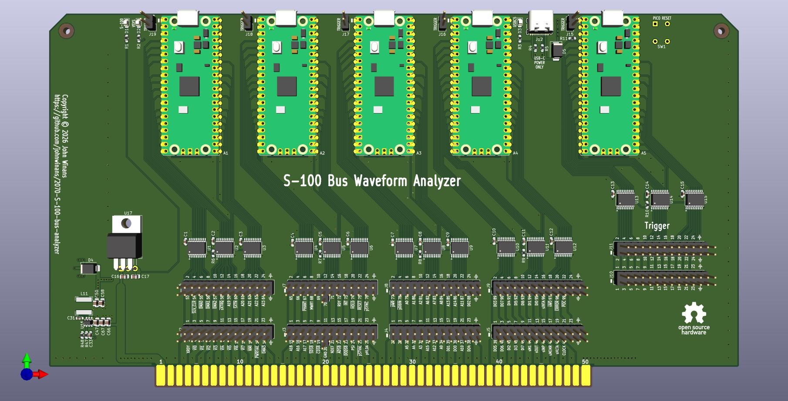

# 2070-S-100-bus-analyzer
An S-100 bus logic analyzer

This project is based on the open source ["guzmanb" Logic Analyzer](https://github.com/gusmanb/logicanalyzer) project from Agustín Gimenez Bernad

I have started a [YouTube playlist](https://www.youtube.com/playlist?list=PL3by7evD3F51xCtWdVP3EZzuDttMwDS_U) of videos about this project and my testing of the board.

By using the software from the gusmanb/logicanalyzer repo, a 120 channel logic analyzer can be assembled by installing 5 Raspberry PI PICO boards on this S-100 card and accessed using a USB cables to a PC and/or WiFi as described in the above guzmanb github project Wiki.

Here is a [CSV of the project BOM](./2070-S-100-bus-analyzer.csv) with Dikikey order numbers. 

NOTE: I used generic male-headers that I got on Amazon and snapped to length.  I only use gold-plated headers.  Anything else is annoying.
Here is a link to the type that I use for most everything: https://a.co/d/02YRvqt7 (Hint: I snap them to length using a flat [Hakko Wire Cutters](https://a.co/d/055L9axg). Then use shunts to hold them in pairs, tripples, or whatever you need so they stay straight and aligned when soldering.)

***NOTICE: As of April 20, 2026 Rev 1.0 of this design has been tested and is a fully functional board.  However, I am making some cosmetic tweaks (silkscreen, better testpoints, and I might shorten the PCB by 1/8"... see my self-critique in the above playlist.)  I will post a release (and remove this message) when I consider it in final form.***

